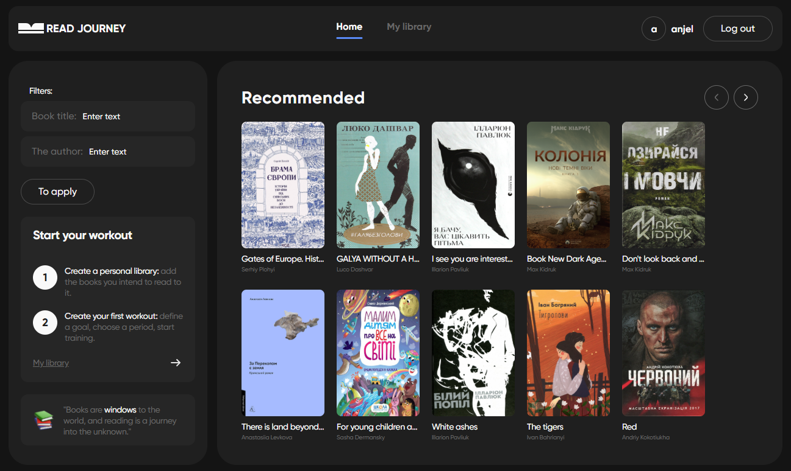

<div style="display: flex; flex-direction: column; align-items: center; gap: 12px">

# Read Journey

[](https://read-journey-ashen.vercel.app)
</div>

<div  style="display: flex; justify-content: center; gap: 12px">

## [**Mockup**](https://www.figma.com/file/z3m0rdBcEfLTJUBDkAKhWQ/BOOKS-READING?type=design&node-id=18743%3A4973&mode=design&t=Hi1KTaUJMogWXZzz-1)

## [**Technical Task**](https://docs.google.com/spreadsheets/d/1_f4IZzXDs6QhQq3mOCOMktYasPW1XphdTO82rdrkyW8/edit?gid=1060862504#gid=1060862504)
</div>

## Project Description

This app is designed for book lovers who want to track their reading progress.
Easily manage your reading list, mark completed books, and stay motivated as you
reach your reading goals.

## 📚 Features

- **Adaptive Design:** 📱 The app features an adaptive layout optimized for
  desktops, tablets, and smartphones, including support for Retina and
  high-resolution displays to ensure crisp and clear visuals on all devices.

- **User Authentication:** 🔐 Secure user registration, login, logout, and
  current user session handling.
- **Recommendations Page (Private):** 🌟 Discover recommended books with:

  - 🔍 **Search** by title or author.
  - 📄 **Pagination** for easy navigation through the book list.
  - ➕ **Add to Library** feature to save recommended books to your personal
    collection.

- **Personal Library Page (Private):** 📖 Manage your own reading collection:

  - 📝 **Add Custom Books** not found in recommendations.
  - 🗂️ **Filter Books** by status: All / In Progress / Read / Unread.
  - 📘 **Start Reading** any book directly from your library.

- **Reading Tracker Page (Private):** ⏱️ Stay motivated and track your reading
  activity:
  - ✅ **Mark** start and end of reading sessions.
  - 📊 **Visual Progress Tracking** via a progress bar and circular chart.

## 🛠️ Main Technologies

- **React:** ⚛️ JavaScript library for building user interfaces.
- **Vite:** ⚡ Next-generation frontend tooling for fast development.
- **React Router:** 🗺️ Declarative routing for React.
- **React Redux:** 📦 Predictable state management for React applications.
- **Redux Persist:** 💾 Persist and rehydrate your Redux store.
- **Axios:** 🌐 Promise-based HTTP client for making API requests.
- **React Helmet:** 🧠 Manage changes to the document head, including title and
  meta tags.
- **React Hook Form:** 📝 Performant and flexible form validation for React.
- **Yup:** ✅ Schema builder for value parsing and validation.
- **React Modal:** 🖼️ Accessible modal dialog component for React.
- **clsx:** ✨ A tiny utility for constructing `className` strings
  conditionally.
- **react-hot-toast:** 🍞 Elegant and simple toast notifications for React.
- **react-spinners:** ⏳ A collection of loading indicators for React.
- **modern-normalize:** 🧼 Normalize browser defaults for consistent styling.
- **Vercel:** 🚀 Deployed and hosted on [Vercel](https://vercel.com/).

## Installation

To set up the project locally, ensure you have one of the following package managers installed: **npm**, **yarn**, **deno**, or **bun**.

### Steps

1. Clone the repository:
    ```bash
    git clone https://github.com/grizeus/read-journey.git
    ```
2. Navigate to the project directory:
    ```bash
    cd read-journey
    ```
3. Install dependencies (using npm as an example):
    ```bash
    npm install
    ```
4. Run the development server:
    ```bash
    npm run dev
    ```

## Usage

After running the development server, open your browser and visit:
http://localhost:5173

Explore the homepage, browse the catalog, and try renting a car to see the app in action.

---

## About the Author

**Petro Zaitsev**  
_GitHub_: [grizeus](https://github.com/grizeus)  

As a dedicated front-end developer with a passion for innovation, I'm excited to connect with like-minded professionals in the tech industry. With expertise in **HTML5, CSS3/SASS, JavaScript/TypeScript, Tailwind, React**, and more, I bring digital projects to life through clean code and thoughtful design. When I'm not coding, I’m learning new technologies and collaborating with driven teams to deliver high-quality results.

---

🚀 **Let’s build something great together!**